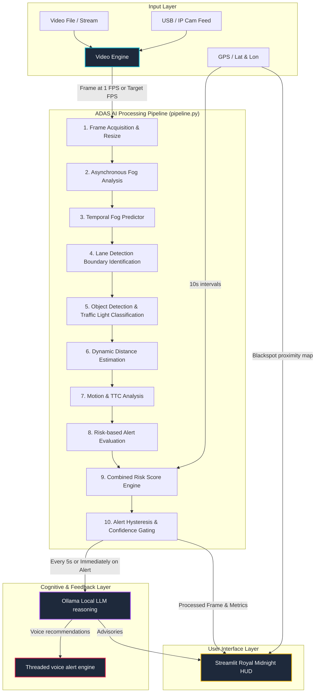

# 🚗 FogVision ADAS: Complete System Documentation & Workflow

FogVision is an advanced, AI-powered **Driver Assistance System (ADAS)** dashboard specifically engineered for low-visibility conditions. It performs real-time visual enhancement, object tracking, sensor fusion, and cognitive AI risk analysis to assist drivers in hazardous, fog-laden environments.

The system utilizes a premium **Royal Midnight Blue** dark theme with glowing Gold and Electric Teal highlights for its Streamlit HUD user interface, optimizing visual ergonomics in in-vehicle head-up display configurations.

---

## 📐 High-Level Architecture & Data Flow

The system is organized around a modular processing pipeline coordinated by [pipeline.py](file:///c:/Users/Puneeth%20Kumar/OneDrive/Desktop/IDP/Project/fodVision/pipeline.py), which runs on a frame-by-frame basis fed from a dedicated frame acquisition engine.



---

## 🔄 End-to-End Processing Workflow (Step-by-Step)

Each analysis cycle executes the following stages:

### Stage 1: Frame Acquisition and Preprocessing
* **Source Capture:** [video_engine.py](file:///c:/Users/Puneeth%20Kumar/OneDrive/Desktop/IDP/Project/fodVision/video_engine.py) handles video stream reading. 
  * **Video Mode:** Executes a two-phase workflow. In Phase 1 (Dehaze), it reads the video, processes fog-dense sections, and saves a temporary video file. In Phase 2 (Detect), it reads the dehazed file at the target frame rate (default 10 FPS).
  * **Live Feed Mode (USB / IP network cams):** Bypasses Phase 1 and pulls frames directly from the webcam, enforcing a 1-FPS `live_interval` lock.
* **Resolution Scaling:** Frames are resized to a standardized coordinate space of $640 \times 480$ pixels to optimize CV inference latency.

### Stage 2: Adaptive Fog Analysis & Trend Forecasting
* **Asynchronous Fog Assessment:** [fog_aware.py](file:///c:/Users/Puneeth%20Kumar/OneDrive/Desktop/IDP/Project/fodVision/fog_aware.py) ([FogAwarePreprocessor](file:///c:/Users/Puneeth%20Kumar/OneDrive/Desktop/IDP/Project/fodVision/fog_aware.py)) runs in a background thread once per second. It uses the Dark Channel Prior (DCP) algorithm from [fog_density.py](file:///c:/Users/Puneeth%20Kumar/OneDrive/Desktop/IDP/Project/fodVision/fog_density.py) to calculate raw fog density percentage, keeping the main dashboard UI smooth and non-blocking.
* **Temporal Predictor:** [temporal_fog_predictor.py](file:///c:/Users/Puneeth%20Kumar/OneDrive/Desktop/IDP/Project/fodVision/temporal_fog_predictor.py) ([TemporalFogPredictor](file:///c:/Users/Puneeth%20Kumar/OneDrive/Desktop/IDP/Project/fodVision/temporal_fog_predictor.py)) maintains an Exponential Moving Average (EMA) smoother and a 5-point linear regression trend analyzer over a rolling history window to predict the next fog density state and determine the visibility trend (`increasing`, `decreasing`, or `stable`).

### Stage 3: Lane Detection
* **Lane Identification:** [lane_detection.py](file:///c:/Users/Puneeth%20Kumar/OneDrive/Desktop/IDP/Project/fodVision/lane_detection.py) ([LaneDetector](file:///c:/Users/Puneeth%20Kumar/OneDrive/Desktop/IDP/Project/fodVision/lane_detection.py)) computes driving lane boundary polygons. It generates a static perspective trapezoid masking the front lane and small peripherals to divide visual targets into **In-Lane Targets** and **Peripheral/Out-of-Lane Targets**.

### Stage 4: Vision Perception (YOLO & HSV Color Classification)
* **YOLO Inference:** [object_detect.py](file:///c:/Users/Puneeth%20Kumar/OneDrive/Desktop/IDP/Project/fodVision/object_detect.py) runs a lightweight `YOLOv8n` model on the raw frame, detecting cars, trucks, pedestrians, cyclists, and traffic signals.
* **Traffic Light Classifier:** When a traffic light is detected, the bounding box region is cropped and mapped into the HSV (Hue, Saturation, Value) color space in [object_detect.py#L478](file:///c:/Users/Puneeth%20Kumar/OneDrive/Desktop/IDP/Project/fodVision/object_detect.py#L478) to classify the active state (`RED`, `YELLOW`, `GREEN`, or `UNKNOWN`).

### Stage 5: Distance Calibration & Sensor Fusion
The distance to detected targets is resolved depending on the selected input mode:
* **Video Mode:** The pipeline utilizes a deep learning **MiDaS Small depth model** (`torch.hub.load("intel-isl/MiDaS", "MiDaS_small")`) cached to execute every 3rd frame. It maps the median relative depth of bounding box regions to physical meters (clamped between 2.0m and 80.0m).
* **Live Feed Mode:** Detections are mapped via [improved_distance.py](file:///c:/Users/Puneeth%20Kumar/OneDrive/Desktop/IDP/Project/fodVision/improved_distance.py) ([EnhancedDistanceEstimator](file:///c:/Users/Puneeth%20Kumar/OneDrive/Desktop/IDP/Project/fodVision/improved_distance.py#L33)), which uses camera pinhole geometry and class-height specifications. It then fuses these estimates with Simulated/Hardware LiDAR data in [sensor_fusion.py](file:///c:/Users/Puneeth%20Kumar/OneDrive/Desktop/IDP/Project/fodVision/sensor_fusion.py) ([SensorFusion](file:///c:/Users/Puneeth%20Kumar/OneDrive/Desktop/IDP/Project/fodVision/sensor_fusion.py#L15)), preferring LiDAR depth values if available.

### Stage 6: Motion & Time-to-Collision (TTC) Analysis
* **Ego-Speed Processing:** Ego-vehicle speed is supplied by the user (defaulting to 50 km/h) in the dashboard settings.
* **TTC Calculation:** [motion_ttc.py](file:///c:/Users/Puneeth%20Kumar/OneDrive/Desktop/IDP/Project/fodVision/motion_ttc.py) ([MotionAnalyzer](file:///c:/Users/Puneeth%20Kumar/OneDrive/Desktop/IDP/Project/fodVision/motion_ttc.py#L29)) computes the relative velocities of preceding visual tracks. It estimates Time-to-Collision values (TTC) in seconds and flags threats if $TTC < 2.0s$ (Critical) or $TTC < 5.0s$ (Warning).

### Stage 7: Integrated Risk Score Engine
* **Consolidated Assessment:** [risk_score.py](file:///c:/Users/Puneeth%20Kumar/OneDrive/Desktop/IDP/Project/fodVision/risk_score.py) ([compute_risk](file:///c:/Users/Puneeth%20Kumar/OneDrive/Desktop/IDP/Project/fodVision/risk_score.py#L38)) evaluates all aggregated pipeline parameters to output a normalized hazard index ($0.0$ to $1.0$) and threat level (`LOW`, `MEDIUM`, or `HIGH`).
* **Hard Overrides:** Employs safety triggers to force a `HIGH` (minimum 0.70) or `MEDIUM` (minimum 0.35) risk rating when immediate collision thresholds are crossed.

### Stage 8: Alert Filtering, Confidence Gating, and Hysteresis
* **Confidence Gating:** [confidence_gated_alerts.py](file:///c:/Users/Puneeth%20Kumar/OneDrive/Desktop/IDP/Project/fodVision/confidence_gated_alerts.py) ([ConfidenceGatedAlerts](file:///c:/Users/Puneeth%20Kumar/OneDrive/Desktop/IDP/Project/fodVision/confidence_gated_alerts.py#L12)) verifies target consistency. Detections must maintain minimum confidence thresholds (default 0.5) over $3$ consecutive frames to trigger warnings, filtering out transient frame noise.
* **Hysteresis Filtration:** [alert_hysteresis.py](file:///c:/Users/Puneeth%20Kumar/OneDrive/Desktop/IDP/Project/fodVision/alert_hysteresis.py) ([AlertHysteresis](file:///c:/Users/Puneeth%20Kumar/OneDrive/Desktop/IDP/Project/fodVision/alert_hysteresis.py#L21)) prevents alert oscillation/flicker by locking triggered alerts for a cooldown window (Warning: 5s, Critical: 10s).

### Stage 9: Cognitive LLM Reasoning and Threaded Voice Alerts
* **LLM Gating:** Every 5 seconds (or 1.5 seconds if an active safety hazard is triggered), the pipeline creates a structured driving context payload [DrivingContext](file:///c:/Users/Puneeth%20Kumar/OneDrive/Desktop/IDP/Project/fodVision/llm.py#L77) mapping current metrics.
* **Local Ollama Model:** Passes context to a local Ollama model (`llama3.1:latest` or `qwen3:1.7b`) to fetch a safety recommendation.
* **Speech Synthesis:** If a voice advisory is generated, it is passed to [voice_alert.py](file:///c:/Users/Puneeth%20Kumar/OneDrive/Desktop/IDP/Project/fodVision/voice_alert.py) ([speak_alert](file:///c:/Users/Puneeth%20Kumar/OneDrive/Desktop/IDP/Project/fodVision/voice_alert.py#L800)). This uses a multi-threaded daemon loop to synthesize and speak the message using the host system TTS, avoiding main pipeline execution pauses.

---

## 🧠 Codebase Module Registry & Symbol Index

Here is the index of key modules and classes in the codebase. Click files to view source locations.

| Category | File | Key Symbols | Description |
| :--- | :--- | :--- | :--- |
| **HUD & Orchestrator** | [DashBoard.py](file:///c:/Users/Puneeth%20Kumar/OneDrive/Desktop/IDP/Project/fodVision/DashBoard.py) | *Main Application* | Streamlit web application. Renders live camera feed, speedometer widgets, FOLIUM blackspot GIS maps, speed control overrides, risk score gauges, and LLM text advisory output panels. |
| | [pipeline.py](file:///c:/Users/Puneeth%20Kumar/OneDrive/Desktop/IDP/Project/fodVision/pipeline.py) | [ADASPipeline](file:///c:/Users/Puneeth%20Kumar/OneDrive/Desktop/IDP/Project/fodVision/pipeline.py#L63)<br>[_rule_engine](file:///c:/Users/Puneeth%20Kumar/OneDrive/Desktop/IDP/Project/fodVision/pipeline.py#L604) | Core ADAS orchestrator. Executes frame sizing, maps variables, manages cached geocoding, coordinates background async threads, and sequences LLD modules. |
| | [video_engine.py](file:///c:/Users/Puneeth%20Kumar/OneDrive/Desktop/IDP/Project/fodVision/video_engine.py) | [VideoEngine](file:///c:/Users/Puneeth%20Kumar/OneDrive/Desktop/IDP/Project/fodVision/video_engine.py#L38)<br>[VideoFrame](file:///c:/Users/Puneeth%20Kumar/OneDrive/Desktop/IDP/Project/fodVision/video_engine.py#L30) | Dual-phase frame acquisition engine. Manages pre-dehazing file writes and delivers target playback frames (10 FPS default for video, 1 FPS for live webcam feeds). |
| **Visual Processing** | [fog_density.py](file:///c:/Users/Puneeth%20Kumar/OneDrive/Desktop/IDP/Project/fodVision/fog_density.py) | [estimate_fog_density](file:///c:/Users/Puneeth%20Kumar/OneDrive/Desktop/IDP/Project/fodVision/fog_density.py#L403)<br>[get_dark_channel](file:///c:/Users/Puneeth%20Kumar/OneDrive/Desktop/IDP/Project/fodVision/fog_density.py#L369) | Measures fog thickness by applying the Dark Channel Prior (DCP) algorithm over localized $15\times15$ pixel morphology channels. |
| | [dehaze.py](file:///c:/Users/Puneeth%20Kumar/OneDrive/Desktop/IDP/Project/fodVision/dehaze.py) | [DehazeModel](file:///c:/Users/Puneeth%20Kumar/OneDrive/Desktop/IDP/Project/fodVision/dehaze.py#L441) | Removes atmospheric haze from image channels using Dark Channel transmission maps and atmospheric scattering adjustments. |
| | [fog_aware.py](file:///c:/Users/Puneeth%20Kumar/OneDrive/Desktop/IDP/Project/fodVision/fog_aware.py) | [FogAwarePreprocessor](file:///c:/Users/Puneeth%20Kumar/OneDrive/Desktop/IDP/Project/fodVision/fog_aware.py) | Provides a wrapper to perform fog density checks asynchronously in background threads. |
| | [temporal_fog_predictor.py](file:///c:/Users/Puneeth%20Kumar/OneDrive/Desktop/IDP/Project/fodVision/temporal_fog_predictor.py) | [TemporalFogPredictor](file:///c:/Users/Puneeth%20Kumar/OneDrive/Desktop/IDP/Project/fodVision/temporal_fog_predictor.py#L15) | Computes rolling EMA visibility parameters and fits linear trend slopes to predict upcoming fog drift. |
| **Perception & Tracking**| [object_detect.py](file:///c:/Users/Puneeth%20Kumar/OneDrive/Desktop/IDP/Project/fodVision/object_detect.py) | [process_frame](file:///c:/Users/Puneeth%20Kumar/OneDrive/Desktop/IDP/Project/fodVision/object_detect.py#L492)<br>[detect_traffic_light_color](file:///c:/Users/Puneeth%20Kumar/OneDrive/Desktop/IDP/Project/fodVision/object_detect.py#L478) | Runs YOLOv8 object detection on CUDA/CPU. Extracts traffic light bounding boxes and classifies red/yellow/green states via HSV color threshold filters. |
| | [lane_detection.py](file:///c:/Users/Puneeth%20Kumar/OneDrive/Desktop/IDP/Project/fodVision/lane_detection.py) | [LaneDetector](file:///c:/Users/Puneeth%20Kumar/OneDrive/Desktop/IDP/Project/fodVision/lane_detection.py#L18) | Projects lane boundary overlays onto video frames and provides polygon coordinates to identify which detected objects are in-lane. |
| **Distance & Fusion** | [improved_distance.py](file:///c:/Users/Puneeth%20Kumar/OneDrive/Desktop/IDP/Project/fodVision/improved_distance.py) | [EnhancedDistanceEstimator](file:///c:/Users/Puneeth%20Kumar/OneDrive/Desktop/IDP/Project/fodVision/improved_distance.py#L33) | Estimates target distance based on class heights (e.g. truck: 3.8m, car: 1.5m, person: 1.75m) and bounding box focal scale pixel ratios. |
| | [sensor_fusion.py](file:///c:/Users/Puneeth%20Kumar/OneDrive/Desktop/IDP/Project/fodVision/sensor_fusion.py) | [SensorFusion](file:///c:/Users/Puneeth%20Kumar/OneDrive/Desktop/IDP/Project/fodVision/sensor_fusion.py#L15) | Fuses monocular camera detections with simulated LiDAR sensor point clouds and estimates road curvature. |
| | [lidar_sensor.py](file:///c:/Users/Puneeth%20Kumar/OneDrive/Desktop/IDP/Project/fodVision/lidar_sensor.py) | [LidarDistanceEstimator](file:///c:/Users/Puneeth%20Kumar/OneDrive/Desktop/IDP/Project/fodVision/lidar_sensor.py#L63)<br>[LidarSensor](file:///c:/Users/Puneeth%20Kumar/OneDrive/Desktop/IDP/Project/fodVision/lidar_sensor.py#L15) | Interfaces with LiDAR sensor hardware. Employs Simulated/Vision fallback ranges when the sensor is disconnected. |
| **Threat Assessment** | [motion_ttc.py](file:///c:/Users/Puneeth%20Kumar/OneDrive/Desktop/IDP/Project/fodVision/motion_ttc.py) | [MotionAnalyzer](file:///c:/Users/Puneeth%20Kumar/OneDrive/Desktop/IDP/Project/fodVision/motion_ttc.py#L29) | Calculates relative approach speeds ($m/s$) and Time-to-Collision (TTC) values for preceding vehicles. |
| | [risk_score.py](file:///c:/Users/Puneeth%20Kumar/OneDrive/Desktop/IDP/Project/fodVision/risk_score.py) | [compute_risk](file:///c:/Users/Puneeth%20Kumar/OneDrive/Desktop/IDP/Project/fodVision/risk_score.py#L38) | Calculates a normalized hazard score from fog density, target proximity, vehicle speed, and geocoded road hazard variables. |
| | [risk_alerts.py](file:///c:/Users/Puneeth%20Kumar/OneDrive/Desktop/IDP/Project/fodVision/risk_alerts.py) | [RiskBasedAlertSystem](file:///c:/Users/Puneeth%20Kumar/OneDrive/Desktop/IDP/Project/fodVision/risk_alerts.py) | Evaluates safety risk warnings based on safety zones and collision thresholds. |
| | [alert_hysteresis.py](file:///c:/Users/Puneeth%20Kumar/OneDrive/Desktop/IDP/Project/fodVision/alert_hysteresis.py) | [AlertHysteresis](file:///c:/Users/Puneeth%20Kumar/OneDrive/Desktop/IDP/Project/fodVision/alert_hysteresis.py#L21) | Implements alert cooldown timers and warn-to-critical escalation thresholds to prevent false alarm spam. |
| | [confidence_gated_alerts.py](file:///c:/Users/Puneeth%20Kumar/OneDrive/Desktop/IDP/Project/fodVision/confidence_gated_alerts.py) | [ConfidenceGatedAlerts](file:///c:/Users/Puneeth%20Kumar/OneDrive/Desktop/IDP/Project/fodVision/confidence_gated_alerts.py#L12) | Gates alert activation, requiring detections to meet confidence thresholds for $N$ consecutive frames. |
| **Cognitive Advisory** | [llm.py](file:///c:/Users/Puneeth%20Kumar/OneDrive/Desktop/IDP/Project/fodVision/llm.py) | [get_llm_decision](file:///c:/Users/Puneeth%20Kumar/OneDrive/Desktop/IDP/Project/fodVision/llm.py#L255)<br>[DrivingContext](file:///c:/Users/Puneeth%20Kumar/OneDrive/Desktop/IDP/Project/fodVision/llm.py#L77) | Wraps Ollama local model calls. Submits JSON-formatted driving states and returns validated schema structures. |
| | [voice_alert.py](file:///c:/Users/Puneeth%20Kumar/OneDrive/Desktop/IDP/Project/fodVision/voice_alert.py) | [speak_alert](file:///c:/Users/Puneeth%20Kumar/OneDrive/Desktop/IDP/Project/fodVision/voice_alert.py#L800) | Spawns background daemon threads to execute text-to-speech voice alerts using `pyttsx3`. |
| | [road_context.py](file:///c:/Users/Puneeth%20Kumar/OneDrive/Desktop/IDP/Project/fodVision/road_context.py) | [get_road_context](file:///c:/Users/Puneeth%20Kumar/OneDrive/Desktop/IDP/Project/fodVision/road_context.py#L19) | Retrieves Nominatim reverse geocoding addresses and checks the geospatial database for nearby accident blackspots. |

> [!NOTE]
> **Stale / Deprecated Code Specification Alignments:**
> 1. **Brake-Light Red Glow Detection & BBox Tracker:** Baseline text documentation notes a separate HSV-based brake light detection module (`red_glow.py`) and a tracking filter (`object_tracker.py`). In the active pipeline implementation ([pipeline.py](file:///c:/Users/Puneeth%20Kumar/OneDrive/Desktop/IDP/Project/fodVision/pipeline.py)), these sub-blocks are **DELETED/DISABLED**. Target lists are mapped as a flat array with dummy `track_id = 0` to preserve compatibility with downstream motion analysis modules.
> 2. **Distance Calibration in Video Mode:** Baseline documents note that distance is locked to a constant 20.0m in Video Mode. The active pipeline code uses a deep learning **MiDaS Small depth model** to calculate physical distances dynamically from relative depth estimates.
> 3. **Risk Weights:** Active risk calculation weights are Fog (0.35), Distance (0.30), Speed (0.20), Road Context (0.10), and Humidity (0.05). Brake-light indicators are no longer factored into the weights.

---

## 📐 Core Mathematical & Algorithmic Formulations

### 1. Dark Channel Prior (DCP) Fog Calculation
The Dark Channel Prior is based on the observation that outdoor, haze-free images contain pixels that have very low intensity in at least one color channel (RGB):
$$J^{dark}(x) = \min_{c \in \{R,G,B\}} \left( \min_{y \in \Omega(x)} J^c(y) \right)$$
where $\Omega(x)$ is a patch centered at pixel $x$. In fog-laden images, atmospheric scattering increases the intensity of the dark channel:
$$I(x) = J(x)t(x) + A(1 - t(x))$$
where:
* $I(x)$ is the observed hazy image.
* $J(x)$ is the original scene radiance (clear image).
* $t(x)$ is the transmission map representing the portion of light that reaches the camera.
* $A$ is the global atmospheric light.

Fog density is calculated as:
$$\text{Fog Density (\%)} = \text{mean}(J^{dark}) \times 100.0$$

### 2. Temporal Fog Predictor (EMA & Linear Regression)
* **Exponential Moving Average:**
$$\text{EMA}_t = \alpha \cdot \text{Fog}_t + (1 - \alpha) \cdot \text{EMA}_{t-1}$$
where $\alpha = 0.3$.
* **Linear Regression Prediction:**
The next state is predicted by fitting a straight line $y = mx + c$ over the last 5 readings:
$$m = \frac{N\sum(xy) - \sum x\sum y}{N\sum(x^2) - (\sum x)^2}$$
$$\text{Predicted Next} = m \cdot (\text{length}) + c$$

### 3. MiDaS Depth Distance Calibration
Relative depth maps from MiDaS are transformed to physical distances in meters using:
$$\text{Distance (meters)} = \text{clip}\left(\frac{3000.0}{\text{median\_depth} + 10^{-5}}, 2.0, 80.0\right)$$

### 4. Integrated Risk Score Calculation
The risk score is calculated as a weighted sum of normalized components:
$$\text{Risk Score} = w_f \cdot C_f + w_d \cdot C_d + w_s \cdot C_s + w_r \cdot C_r + w_h \cdot C_h$$
where:
* Weights: $w_f = 0.35$ (fog), $w_d = 0.30$ (distance), $w_s = 0.20$ (speed), $w_r = 0.10$ (road), $w_h = 0.05$ (humidity).
* $C_f = \text{Fog Density} / 100.0$.
* $C_d = 1.0 - \text{normalise}(D_{nearest}, 5.0, 60.0)$ (closer objects = higher risk).
* $C_s = \text{Speed} / 120.0$ (boosted by $1.5\times$ if fog density $> 60.0\%$).
* $C_r = 0.4$ (if accident blackspot nearby) $+ 0.3$ (if curve road detected).
* $C_h = \text{Humidity} / 100.0$ (currently a placeholder).

### 5. Hard Override Safety Rules
* **Immediate Proximity:** If $0 < D_{nearest} < 10.0$ meters, risk score is immediately elevated to a minimum of **0.70 (HIGH)**.
* **Curvature Hazard:** If the road type is a curve and $0 < D_{nearest} < 25.0$ meters, the risk score is elevated to a minimum of **0.35 (MEDIUM)**.

---

## 🕰️ Execution Frequency & Scheduler Constraints

To maintain real-time performance on consumer hardware (such as an NVIDIA RTX 3050), the pipeline schedules modules using distinct time gates:

| Module | Execution Frequency | Timing/Gating Mechanism | Typical Latency |
| :--- | :--- | :--- | :--- |
| **Frame Acquisition** | 10 Hz (Video) / 1 Hz (Webcam) | `video_engine.py` FPS limiter | ~2 ms |
| **Fog Analysis** | 1 Hz (Every 1s) | Asynchronous thread `run_fog_async` | ~580 ms (async) |
| **Object Detection & HSV** | Every Frame (10 Hz / 1 Hz) | Inline `pipeline.py` | ~35 ms |
| **MiDaS Depth (Video Mode)** | Every 3rd Frame | Clock-cached block in `pipeline.py` | ~85 ms |
| **Motion & TTC Analysis** | Every Frame (10 Hz / 1 Hz) | Inline `pipeline.py` | < 15 ms |
| **Road Context & GIS Map** | 0.1 Hz (Every 10s) | Clock-gated block in `pipeline.py` | ~5 ms |
| **Local LLM Reasoning** | 0.2 Hz (Every 5s) / 1.5s on alert | Asynchronous thread `run_llm_async` | ~1500 ms (async) |
| **Voice Alerts (TTS)** | Event-driven (5s cooldown) | Threaded background task `_speak` | Async (0 ms block) |

---

## 🚀 Installation & Operation Guide

### 1. Prerequisites
* **Python 3.8 to 3.13** installed.
* **NVIDIA GPU** with CUDA toolkit (recommended; falls back to CPU automatically).
* **Ollama** installed on the host system (download from [ollama.com](https://ollama.com)).

### 2. Setup Steps
1. Navigate to the project root directory:
   ```powershell
   cd "c:\Users\Puneeth Kumar\OneDrive\Desktop\IDP\Project\fodVision"
   ```
2. Create and activate a Python virtual environment:
   ```powershell
   python -m venv venv
   .\venv\Scripts\Activate.ps1
   ```
3. Install package dependencies:
   ```powershell
   pip install -r Requirements.txt
   ```
4. Start the Ollama background service and download the default reasoning model:
   * In a separate terminal run:
     ```bash
     ollama serve
     ```
   * In your main terminal run:
     ```powershell
     ollama pull llama3.1:latest
     ```
     *(Note: To use a smaller model like `qwen3:1.7b` or `deepseek-r1:1.5b`, pull it via Ollama and update the `MODEL_NAME` in [llm.py](file:///c:/Users/Puneeth%20Kumar/OneDrive/Desktop/IDP/Project/fodVision/llm.py).)*

### 3. Launching the App
Run the Streamlit application:
```powershell
python -m streamlit run DashBoard.py
```
Open [http://localhost:8501](http://localhost:8501) in your browser.

---

## ⚙️ Verification & Troubleshooting

### Pipeline Verification Tests
You can verify the pipeline logic, modes, and distance overrides using the automated test suite:
```powershell
.\venv\Scripts\python.exe -m unittest test_pipeline_modes.py
```

### Common Issues
* **Ollama Connection Refused:** Make sure the Ollama service is running (`ollama serve`) in a separate terminal before starting the dashboard.
* **Missing Package Errors (e.g. `geopy` or `pyttsx3`):** Ensure the virtual environment is active and run:
  ```powershell
  pip install geopy pyttsx3 requests streamlit streamlit-folium streamlit-js-eval folium ollama ultralytics torch torchvision torchaudio
  ```
* **High Latency / Frozen UI:** Ensure the `run_fog_async` and `run_llm_async` background threads are enabled in `pipeline.py`. If you don't have a GPU, the MiDaS depth model will run on the CPU, which may lower the video processing frame rate.

---

## 🔄 System Workflow Summary

The **FogVision ADAS** operates on a modular frame-by-frame processing pipeline designed for low-visibility road safety:

1. **Frame Ingestion:** Frames are captured from an uploaded video (10 FPS Phase 2 playback) or live webcam stream (1 FPS locks) using [video_engine.py](file:///c:/Users/Puneeth%20Kumar/OneDrive/Desktop/IDP/Project/fodVision/video_engine.py).
2. **Fog Assessment:** Raw frames are evaluated for fog density percentage using the `pyfade` library in [fog_density.py](file:///c:/Users/Puneeth%20Kumar/OneDrive/Desktop/IDP/Project/fodVision/fog_density.py).
3. **Adaptive Dehazing:** If fog density is high ($>35\%$), a Dark Channel Prior (DCP) restoration model in [dehaze.py](file:///c:/Users/Puneeth%20Kumar/OneDrive/Desktop/IDP/Project/fodVision/dehaze.py) is applied to recover details.
4. **Lane Boundaries:** Driving lane boundaries are mapped in [lane_detection.py](file:///c:/Users/Puneeth%20Kumar/OneDrive/Desktop/IDP/Project/fodVision/lane_detection.py) to isolate in-lane targets.
5. **Visual Perception:** YOLOv8n object detection classifies road targets (vehicles, people, traffic lights). Cropped traffic signals are classified in HSV space.
6. **Distance Estimation:**
   - **Video Mode:** Relative depth mapping via the `MiDaS` model estimates distance.
   - **Live Mode (Plan A):** Physical VL53L0X distance sensors on an ESP32 microcontroller measure zone depth (left, middle, right) and compare them with MiDaS.
7. **Threat Assessment:** Relative approach speed and Time-To-Collision (TTC) are calculated in [motion_ttc.py](file:///c:/Users/Puneeth%20Kumar/OneDrive/Desktop/IDP/Project/fodVision/motion_ttc.py). Active alerts are filtered via confidence gating and alert hysteresis.
8. **Cognitive Advisory:** current driving context is structured and sent to local Ollama LLMs (e.g., `qwen3:1.7b` or `deepseek-r1:1.5b`), which output JSON safety guides spoken aloud via a threaded TTS engine ([voice_alert.py](file:///c:/Users/Puneeth%20Kumar/OneDrive/Desktop/IDP/Project/fodVision/voice_alert.py)).

