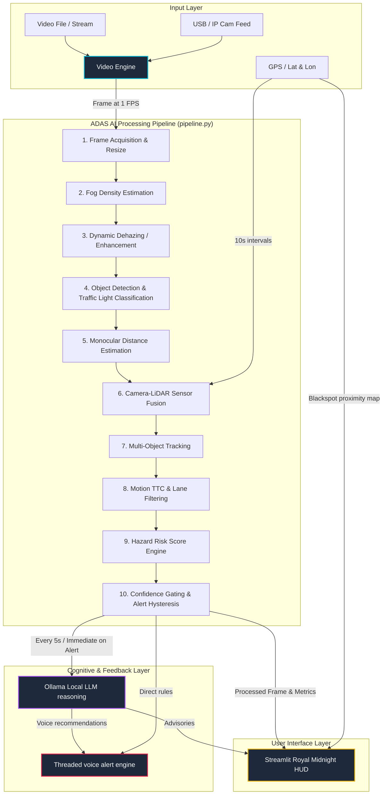

# 🚗 FogVision ADAS: Detailed System Workflow & Architecture

FogVision is an advanced, AI-powered Driver Assistance System (ADAS) dashboard specifically engineered for low-visibility conditions. It performs real-time visual enhancement, object tracking, sensor fusion, and cognitive AI risk analysis to assist drivers in hazardous, fog-laden environments.

This document describes the complete processing pipeline, component interactions, and data-flow pathways of the system.

---

## 📐 High-Level Architecture

The system is designed around a modular pipeline coordinated by [pipeline.py](file:///c:/Users/Puneeth%20Kumar/OneDrive/Desktop/IDP/Project/fodVision/pipeline.py), running on a frame-by-frame basis fed from a dedicated 1-FPS frame acquisition engine.

---

## 🔄 End-to-End Processing Workflow (Step-by-Step)

Each analysis cycle executes the following stages:

### Stage 1: Frame Acquisition and Preprocessing
* **Sampling Contract:** The [video_engine.py](file:///c:/Users/Puneeth%20Kumar/OneDrive/Desktop/IDP/Project/fodVision/video_engine.py) captures frames from the active input. In video mode, it skips $FPS - 1$ frames per second, delivering exactly **1 frame per source-second** to the pipeline to ensure inference stability.
* **Resolution Scaling:** Frames are resized to a standardized coordinate space of $640 \times 480$ pixels to optimize CPU/GPU throughput.

### Stage 2: Adaptive Fog Analysis & Trend Forecasting
* **Dark Channel Prior (DCP):** The frame is evaluated in [fog_density.py](file:///c:/Users/Puneeth%20Kumar/OneDrive/Desktop/IDP/Project/fodVision/fog_density.py) using the Dark Channel Prior algorithm to compute a raw fog density percentage.
* **Temporal Predictor:** The [temporal_fog_predictor.py](file:///c:/Users/Puneeth%20Kumar/OneDrive/Desktop/IDP/Project/fodVision/temporal_fog_predictor.py) runs an Exponential Moving Average (EMA) smoother over a 10-frame sliding window to predict the fog density trend (Increasing, Decreasing, or Stable) and anticipate visibility drops.
* **Visibility Mapping:** Fog values are mapped to safety ranges:
  * **Low/Clear (<20%):** Standard driving rules.
  * **Moderate (20% - 40%):** Advisory warnings.
  * **Heavy (40% - 60%):** Reduced speed limits.
  * **Severe (>60%):** Contrast/dehazing triggers.

### Stage 3: Image Enhancement (Dynamic Dehazing)
* **Threshold-Triggered Dehazing:** If fog density is high ($\ge 30\%$), the image is routed to the dynamic preprocessing module.
* **DehazeFormer-S:** A state-of-the-art single-image dehazing neural net (or local CLAHE adaptive contrast fallback) is applied to restore visibility, enhance edges, and recover lost atmospheric colors.

### Stage 4: Vision Perception (YOLO & HSV Color Classification)
* **Model Inference:** The enhanced frame is analyzed by a YOLOv8 network ([object_detect.py](file:///c:/Users/Puneeth%20Kumar/OneDrive/Desktop/IDP/Project/fodVision/object_detect.py)) to detect surrounding vehicles, trucks, pedestrians, cyclists, and traffic signals.
* **Traffic Light Classifier:** When a traffic light is detected, the bounding box region is cropped and mapped into the HSV (Hue, Saturation, Value) color space to classify the active state (`RED`, `YELLOW`, `GREEN`, or `UNKNOWN`).

### Stage 5: Multi-Object Track Management
* **IoU Tracker:** In [object_tracker.py](file:///c:/Users/Puneeth%20Kumar/OneDrive/Desktop/IDP/Project/fodVision/object_tracker.py), an Intersection-over-Union tracking filter registers unique IDs for detected items across frames.
* **Activation Threshold:** A detection must be tracked successfully for at least 3 consecutive frames (`min_hits = 3`) to become an active, confirmed track, filtering out transient false-positives.

### Stage 6: Distance Calibration & Sensor Fusion
The distance to each tracked vehicle is resolved based on the input mode:
* **Video Mode (Calibration Standard):** All distances are locked to a constant `20.0m` (labeled as `constant_video`) to allow reliable risk engine testing and visual debugging.
* **Live Mode (Monocular + LiDAR Fusion):**
  * **Monocular Height Estimator:** Estimates distance based on camera pinhole models and class height mappings (e.g., standard car height vs. pedestrian height).
  * **LiDAR Fusion:** Fuses camera detections with simulated or hardware LiDAR point cloud returns. Prioritizes LiDAR when confidence is $\ge 70\%$ and data aligns, falling back to camera geometry in dense fog or sensor drops.

### Stage 7: Dynamics and Lane-Relative Filtering
* **Motion Analyzer:** Computes the relative speed ($m/s$) of preceding vehicles based on bounding box changes and ego-vehicle speed in [motion_ttc.py](file:///c:/Users/Puneeth%20Kumar/OneDrive/Desktop/IDP/Project/fodVision/motion_ttc.py).
* **Time-to-Collision (TTC):** Predicts the collision vector in seconds. Threats are flagged as critical if $TTC < 2.0s$ or warning if $TTC < 5.0s$.
* **Lane Boundaries:** Coordinates are validated in [lane_detection.py](file:///c:/Users/Puneeth%20Kumar/OneDrive/Desktop/IDP/Project/fodVision/lane_detection.py). Detected objects are split into **In-Lane Targets** (direct collision path) and **Peripheral/Out-of-Lane Targets**.

### Stage 8: Integrated Risk Score Engine
The [risk_score.py](file:///c:/Users/Puneeth%20Kumar/OneDrive/Desktop/IDP/Project/fodVision/risk_score.py) engine computes a consolidated risk index ($0$ to $100$) by combining:
1. **Fog Density Risk:** Degraded visibility weight.
2. **Target Proximity Risk:** The distance to the nearest in-lane obstacle.
3. **Vehicle Speed Risk:** Ego-speed of the vehicle (derived directly from the Vehicular setting).
4. **Active Red Signal/Brake Light presence.**
5. **Blackspot Proximity:** GIS database lookup.

### Stage 9: Confidence Gating & Alert Hysteresis
* **Confidence Gating:** Safety alerts are blocked if the target does not pass minimum tracking stability gates, suppressing noise.
* **Hysteresis Coordinator:** The [alert_hysteresis.py](file:///c:/Users/Puneeth%20Kumar/OneDrive/Desktop/IDP/Project/fodVision/alert_hysteresis.py) prevents alert spamming or oscillation by enforcing cool-down locks:
  * **Warning cooldown:** 5.0 seconds.
  * **Critical cooldown:** 10.0 seconds.

### Stage 10: LLM Reasoning and Audio Synthesis
* **Structured Payload:** Every 5 seconds, or immediately upon a newly triggered critical alert, a JSON context summarizing fog levels, blackspots, nearest hazards, active speed, and object tracks is passed to Ollama.
* **Ollama Client:** Ollama infers driving recommendations using the local model (e.g., `qwen3:1.7b` or `deepseek-r1:1.5b`).
* **Audio Warning Runner:** Synthesized voice warnings are spoken aloud using a dedicated background thread ([voice_alert.py](file:///c:/Users/Puneeth%20Kumar/OneDrive/Desktop/IDP/Project/fodVision/voice_alert.py)), ensuring the Streamlit application main loop remains responsive.

---

## 🕰️ Timing and Scheduler Constraints

To run heavy AI calculations on hardware like an NVIDIA RTX 3050 without frame drops, the pipeline executes components on distinct time gates:

| Processing Module | Execution Frequency | Timing Mechanism | Target Latency |
| :--- | :--- | :--- | :--- |
| **Frame Acquisition** | 1 FPS (1 Hz) | `video_engine.py` FPS limiter | ~2 ms |
| **Fog & Dehazing** | Every Frame (1 Hz) | Inline `pipeline.py` | ~40 ms |
| **Object Detection & HSV** | Every Frame (1 Hz) | Inline `pipeline.py` | ~35 ms |
| **Sensor Fusion & Tracking** | Every Frame (1 Hz) | Inline `pipeline.py` | ~17 ms |
| **GPS / Road Context** | Every 10 Seconds (0.1 Hz) | Clock-gated block in `pipeline.py` | ~5 ms |
| **Local LLM (Ollama)** | Every 5 Seconds (0.2 Hz) or immediate on alert | Clock-gated block in `pipeline.py` | ~100-300 ms |
| **Voice Alerts (TTS)** | Event-driven with cooldown | Threaded background trigger | Async (0 ms block) |

---

## 📂 Codebase Modules Mapping

* **UI Layer:**
  * [DashBoard.py](file:///c:/Users/Puneeth%20Kumar/OneDrive/Desktop/IDP/Project/fodVision/DashBoard.py): Streamlit GUI containing widgets, folium map, graphs, and live feed viewer.
* **Orchestration Layer:**
  * [pipeline.py](file:///c:/Users/Puneeth%20Kumar/OneDrive/Desktop/IDP/Project/fodVision/pipeline.py): Sequences visual processing, merges data, feeds context logs, checks alerts.
  * [video_engine.py](file:///c:/Users/Puneeth%20Kumar/OneDrive/Desktop/IDP/Project/fodVision/video_engine.py): Direct video parsing and frame rate limiter.
* **Computer Vision Layer:**
  * [fog_density.py](file:///c:/Users/Puneeth%20Kumar/OneDrive/Desktop/IDP/Project/fodVision/fog_density.py): Dark Channel Prior fog intensity metric.
  * [dehaze.py](file:///c:/Users/Puneeth%20Kumar/OneDrive/Desktop/IDP/Project/fodVision/dehaze.py): Generates clear images.
  * [fog_aware.py](file:///c:/Users/Puneeth%20Kumar/OneDrive/Desktop/IDP/Project/fodVision/fog_aware.py): Dynamic, fog-driven confidence and preprocessor scaler.
  * [object_detect.py](file:///c:/Users/Puneeth%20Kumar/OneDrive/Desktop/IDP/Project/fodVision/object_detect.py): YOLOv8 detections & HSV traffic color extractor.
  * [object_tracker.py](file:///c:/Users/Puneeth%20Kumar/OneDrive/Desktop/IDP/Project/fodVision/object_tracker.py): Tracks persistent vehicle IDs.
  * [lane_detection.py](file:///c:/Users/Puneeth%20Kumar/OneDrive/Desktop/IDP/Project/fodVision/lane_detection.py): Driving lane boundaries.
* **Fusion & Dynamics Layer:**
  * [improved_distance.py](file:///c:/Users/Puneeth%20Kumar/OneDrive/Desktop/IDP/Project/fodVision/improved_distance.py): Class height-based relative distance.
  * [lidar_sensor.py](file:///c:/Users/Puneeth%20Kumar/OneDrive/Desktop/IDP/Project/fodVision/lidar_sensor.py) & [sensor_fusion.py](file:///c:/Users/Puneeth%20Kumar/OneDrive/Desktop/IDP/Project/fodVision/sensor_fusion.py): Integrates and matches point clouds.
  * [motion_ttc.py](file:///c:/Users/Puneeth%20Kumar/OneDrive/Desktop/IDP/Project/fodVision/motion_ttc.py): Speed difference and collision seconds.
* **Risk & Warning Layer:**
  * [risk_score.py](file:///c:/Users/Puneeth%20Kumar/OneDrive/Desktop/IDP/Project/fodVision/risk_score.py): Blends parameters into a 0-100 hazard value.
  * [risk_alerts.py](file:///c:/Users/Puneeth%20Kumar/OneDrive/Desktop/IDP/Project/fodVision/risk_alerts.py): Checks distance/TTC gates.
  * [alert_hysteresis.py](file:///c:/Users/Puneeth%20Kumar/OneDrive/Desktop/IDP/Project/fodVision/alert_hysteresis.py): Filters spammy alarms using duration locks.
* **Feedback Layer:**
  * [llm.py](file:///c:/Users/Puneeth%20Kumar/OneDrive/Desktop/IDP/Project/fodVision/llm.py): Context payload encoder and Ollama caller.
  * [scene_memory_buffer.py](file:///c:/Users/Puneeth%20Kumar/OneDrive/Desktop/IDP/Project/fodVision/scene_memory_buffer.py): Context buffer keeping the last 5 frames.
  * [voice_alert.py](file:///c:/Users/Puneeth%20Kumar/OneDrive/Desktop/IDP/Project/fodVision/voice_alert.py): Background text-to-speech speaker.

---

## 🔄 System Workflow Summary

The **FogVision ADAS** operates on a modular frame-by-frame processing pipeline designed for low-visibility road safety:

1. **Frame Ingestion:** Frames are captured from an uploaded video (10 FPS Phase 2 playback) or live webcam stream (1 FPS locks) using [video_engine.py](file:///c:/Users/Puneeth%20Kumar/OneDrive/Desktop/IDP/Project/fodVision/video_engine.py).
2. **Fog Assessment:** Raw frames are evaluated for fog density percentage using the `pyfade` library in [fog_density.py](file:///c:/Users/Puneeth%20Kumar/OneDrive/Desktop/IDP/Project/fodVision/fog_density.py).
3. **Adaptive Dehazing:** If fog density is high ($>35\%$), a Dark Channel Prior (DCP) restoration model in [dehaze.py](file:///c:/Users/Puneeth%20Kumar/OneDrive/Desktop/IDP/Project/fodVision/dehaze.py) is applied to recover details.
4. **Lane Boundaries:** Driving lane boundaries are mapped in [lane_detection.py](file:///c:/Users/Puneeth%20Kumar/OneDrive/Desktop/IDP/Project/fodVision/lane_detection.py) to isolate in-lane targets.
5. **Visual Perception:** YOLOv8n object detection classifies road targets (vehicles, people, traffic lights). Cropped traffic signals are classified in HSV space.
6. **Distance Estimation:**
   - **Video Mode:** Relative depth mapping via the `MiDaS` model estimates distance.
   - **Live Mode (Plan A):** Physical VL53L0X distance sensors on an ESP32 microcontroller measure zone depth (left, middle, right) and compare them with MiDaS.
7. **Threat Assessment:** Relative approach speed and Time-To-Collision (TTC) are calculated in [motion_ttc.py](file:///c:/Users/Puneeth%20Kumar/OneDrive/Desktop/IDP/Project/fodVision/motion_ttc.py). Active alerts are filtered via confidence gating and alert hysteresis.
8. **Cognitive Advisory:** current driving context is structured and sent to local Ollama LLMs (e.g., `qwen3:1.7b` or `deepseek-r1:1.5b`), which output JSON safety guides spoken aloud via a threaded TTS engine ([voice_alert.py](file:///c:/Users/Puneeth%20Kumar/OneDrive/Desktop/IDP/Project/fodVision/voice_alert.py)).

